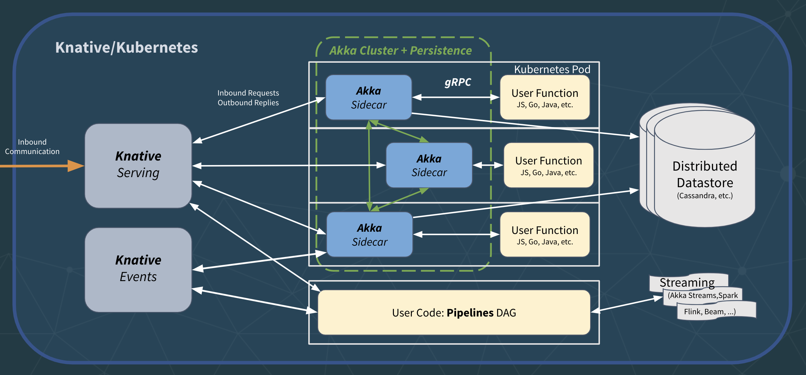
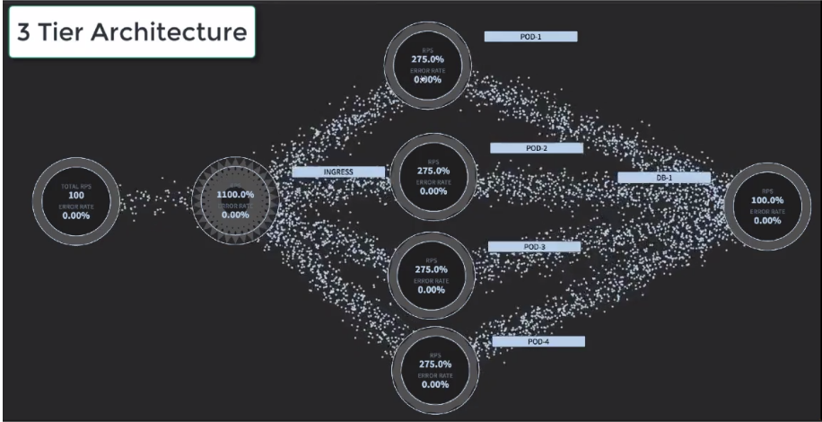
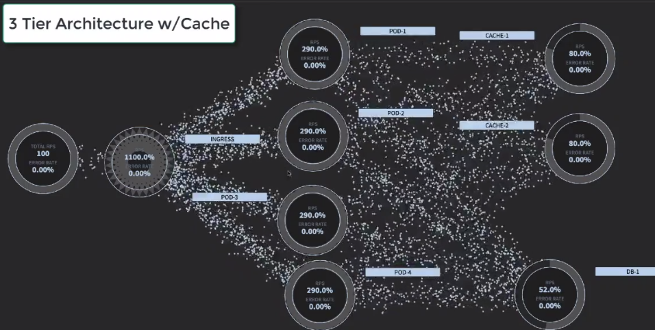
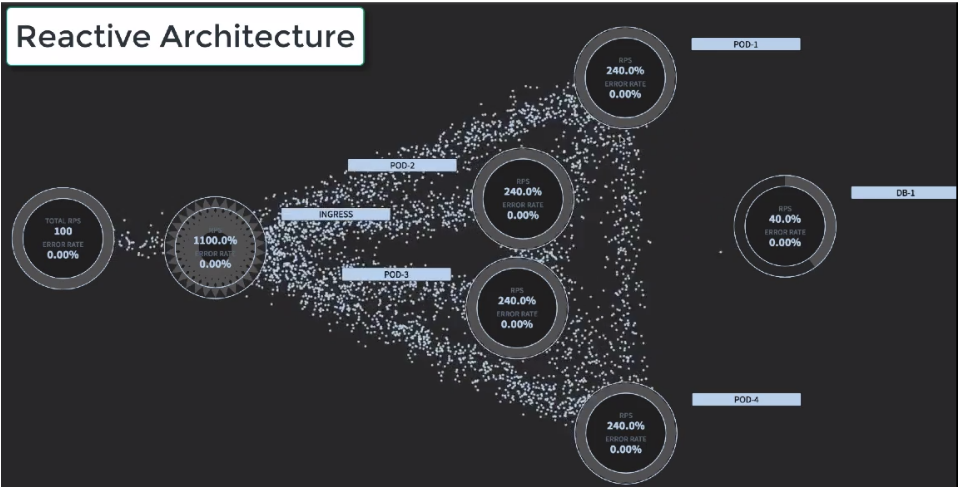

# Towards Stateful Serverless

_"We predict that serverless computing will grow to dominate the future of cloud computing."_

—Jonas et al, ['Cloud computing simplified: a Berkeley view on serverless computing'](https://arxiv.org/abs/1902.03383)

# Elevator Pitch

## Scalable Compute needs Scalable State

Bringing _stateful_ microservices, and the power of _reactive_ technologies to the Cloud Native ecosystem breaks down the final impediment standing in the way of a _Serverless platform for general-purpose application development_, true elastic scalability, and global deployment in the Kubernetes ecosystem. The marriage of Knative and Akka Cluster on Kubernetes allows applications to not only scale efficiently, but to manage distributed state reliably at scale while maintaining its global or local level of data consistency, opening up for a whole range of new addressable use-cases.

## TL;DR

*   The Serverless Developer Experience, from development to production, is revolutionary and will grow to dominate the future of Cloud Computing
    *   FaaS is however— with its ephemeral, stateless, and short-lived functions—only the first step/implementation of the Serverless Developer Experience. 
    *   FaaS is great for processing intensive, parallelizable workloads, moving data from A to B providing enrichment and transformation along the way. But it is quite limited and constrained in what use-cases it addresses well, which makes it very hard/inefficient to implement traditional application development and distributed systems protocols. 
*   What's needed is a next generation Serverless platform and programming model for  general-purpose application development (e.g. microservices, streaming pipelines, ML, etc.). 
    *   One that lets us implement use cases such as: shopping carts, user sessions, transactions, ML models training, low-latency prediction serving, job scheduling, and more.  
    *   What is missing is support for long-lived virtual stateful services, a way to manage distributed state in a scalable and available fashion, and options for choosing the right consistency model for the job. 
*   This next generation Serverless can be built on Knative/Kubernetes, gRPC, and Akka (Cluster, Persistence, etc.).

# Introduction

## Definition

Serverless means different things to different people. Many people consider it the same as Function-as-a-Service (FaaS), but we see it as much more than that: a new category of PaaS, where the key point is the Developer Experience, supporting the full life-cycle of the application, not the programming API of its latest incarnation. 

The definition from the paper[ 'Serverless computing: economic and architectural impact'](https://www.doc.ic.ac.uk/~rbc/papers/fse-serverless-17.pdf), by Adzic et al. paints a broader picture: _"'Serverless' refers to a new generation of platform-as-a-service offerings where the infrastructure provider takes responsibility for receiving client requests and responding to them, capacity planning, task scheduling, and operational monitoring. Developers need to worry only about the logic for processing client requests."_

## What's wrong with Serverless? 

Serverless today is a great platform for stateless services, focusing on scaling from 1-10000 requests and down to zero, and does an amazing job doing this—at scale in a very cost-efficient manner (no events == no cost). It simplifies the delivery of scale and simplicity in operations. 

The current incarnation of Serverless, the so-called Function-as-as Service (FaaS), is a classic data-shipping architecture—we move data to the code, not the other way round. It is great for processing intensive—so-called [embarrassingly parallel](https://en.wikipedia.org/wiki/Embarrassingly_parallel)—workloads, moving data from A to B providing enrichment and transformation along the way. 

We, however, believe that Serverless is more than FaaS (which is only the first step on the journey). It's not about a specific implementation but all about the Developer Experience—a new way of building and running applications, and it's about time that we expand on its scope and supported use-cases. 

## The limitations of FaaS

One limitation of FaaS is that its functions are ephemeral, stateless, and short-lived[^1]. This makes it problematic to build general-purpose data-centric cloud-native applications since it is simply too costly — in terms of performance, latency, and throughput — to lose the computational context (locality of reference) and being forced to load and store the state from the backend storage over and over again. 

Another limitation is that often functions have no direct addressability, which means that they can't communicate directly with each other using point-to-point communication but always need to resort to publish-subscribe, passing all data over some slow and expensive storage medium. A model that can work well for event-driven use-cases but yields too high latency for addressing general-purpose distributed computing problems[^2].

## Stateful serverless computing for an event-driven data-centric world

The serverless movement today is very focused on the automation of the underlying infrastructure, but it has to some extent ignored the equally complicated requirements at the application layer, where the move towards fast data and event-driven stateful architectures creates all sorts of new challenges for operating systems in production.

Functions is a great tool that has its place in the cloud computing toolkit, but for serverless to reach the grand vision that the industry is demanding of a Serverless world while allowing us to build modern data-centric real-time applications, we can't continue to ignore the hardest problem in distributed systems: managing state—your data. 

If Serverless is conceptually about how to remove humans from the equation and solve developers' hardest problems with reasoning about systems in production, then they need declarative APIs and high-level abstractions with rich and easily understood semantics (beyond low-level primitives like functions) for working with never-ending streams of data, manage complex distributed data workflows, and managing distributed state in a reliable, resilient, scalable, and performant way. 

What we need support for is: 
*   _Stateful_ long-lived virtual _addressable_ components.[^3] 
    *   As discussed by [Hellerstein et al](https://blog.acolyer.org/2019/01/14/serverless-computing-one-step-forward-two-steps-back/): _"If the platform pays a cost to create an affinity (e.g. moving data), it should recoup that cost across multiple requests. This motivates the ability for programmers to establish software agents— call them functions, actors, services, etc.— that persist over time in the cloud, with known identities."_
*   A wider range of options for _coordination_ and _communication_ patterns (beyond event-based pub-sub over a broker), including _fine-grained sharing of state_ using common patterns like point-to-point, broadcast, aggregation, merging, shuffling, etc.
    *   As concluded by [Jonas et al](https://arxiv.org/pdf/1902.03383.pdf): _"This limitation also suggests that new variants of serverless computing may be worth exploring, for example naming function instances and allowing direct addressability for access to their internal state (e.g., Actors as a Service)"_.
*   Tools for managing _distributed state_ reliably at scale—in a durable or ephemeral fashion—with _options for consistency_ ranging from _strong_ to _eventual_ and _causal_ consistency[^4], and ways to physically co-locate code and data while remaining logically separate.
    *   As discussed by [Hellerstein et al](https://blog.acolyer.org/2019/01/14/serverless-computing-one-step-forward-two-steps-back/): _"The sequential metaphor of procedural programming will not scale to the cloud. Developers need languages that encourage code that works correctly in small, granular units— of both data and computation— that can be easily moved around across time and space."_
*   Being able to reason about streaming pipelines and the properties[^5] and guarantees the pipeline has as a whole.
*   Predictable performance, latency, and throughput—in startup time, communication, coordination, and durable storage/access of data. 

End-to-end correctness, consistency, and safety mean different things for different services. It's totally dependent on the use-case, and can't be outsourced completely to the infrastructure. The next generation serverless implementations need to provide programming models and a holistic Developer Experience working in concert with the underlying infrastructure maintaining these properties, without continuing to ignore the hardest, and most important problem: how to manage your data in the cloud—reliably at scale.

# Enter Stateful Serverless (Serverless 2.0)

Managing distributed state is hard, but not impossible as long as you are able to rely on the type and nature of the consistency model that is the best fit for your application. Stateful Serverless aims to extend the promise of Serverless and its Developer Experience to general-purpose application development. 

It builds on and extends the traditional stateless FaaS model, by adding support for long-lived addressable stateful services and a way of accessing mapped well-formed data via [gRPC](https://grpc.io/), while allowing for a range of different consistency model—from strong to eventual consistency—based on the nature of the data and how it should be processed, managed, and stored. 

Define your data model, choose its consistency mode and resolution method, and access both your data, data-centric operations, streaming pipelines, and events via a well-formed protocol of gRPC command and read channels.

## Developer Experience

TODO @viktorklang

## High-level design

Stateful Serverless is built on top of Knative and Akka. Each stateful service is backed by an Akka Cluster of durable Akka Actors (event-sourced using Akka Persistence and a distributed database of choice). The user, however, is shielded from these complexities through a set of sidecars bridging the user code to the backend state and cluster management. 

Inbound and outbound communication is always going through the sidecars over gRPC channel[^6] using a constrained and well-defined protocol, in which the user defines commands in, events in, command replies out, and events out. Events are published to Knative Events for others to subscribe to and consume. 

Communicating over a gRPC allows the user code to be implemented in different languages (Scala, Java, Go, JavaScript, etc.).

**TODO: Add Picture**

Managing distributed state isn't just about pushing data from A to B in a reliable fashion. It's about selecting a model that reflects the real world use of the data, and its convergence on usable consistency, not artificially enforced consistency. Being able to have data span clusters, data centers, availability zones, and continents, and maintain a useful coherent state is the gift that Akka gives to Stateful Serverless. Additionally, repetitive work that is better executed in the stateful cluster, or needs to maintain long-running state can be embedded via command channels. 

## Event Sourcing and CRDTs instead of CRUD

Stateful Serverless is incompatible with CRUD. A Serverless infrastructure needs to handle all the nitty-gritty details of storing state before passing it to the user code, something that does not work well with user-defined CRUD operations, which are not constrained enough. For example, it would need to send the entire dataset: _in_ to implement _queries_, and _out_ to implement _updates_. 

What we need are data storage patterns that have constrained input/output protocols. 

Here [event sourcing](https://martinfowler.com/eaaDev/EventSourcing.html) is a great fit where '_state in'_ is an event log, while '_state out'_ is any newly persisted events as a result of handling a command. Another great more constrained technique for state management is [CRDTs](https://en.wikipedia.org/wiki/Conflict-free_replicated_data_type), where '_state in'_ is a stream of deltas and/or state updates, and '_state out'_ is a stream of deltas and/or state updates. 

Event sourcing and CRDTs are on the opposite sides of the state consistency spectrum, the former gives strong (ACID) consistency (through event logging) while the latter eventual/causal consistency. Together they give us a wide range of options for managing distributed state in a consistent fashion by allowing you to choose the optimal model for the specific use-case and data set[^7]. 

# Expanding on the use-cases for Serverless

## Use-cases FaaS addresses well

As we have discussed above, Serverless 1.0 (FaaS) is well suited for parallelizable processing-centric use-cases, where incoming data is pushed downstream through a pipeline of stateless functions doing data enrichment and transformations before pushing it downstream. 

Examples of use-cases of this are[^8]: 

*   **Embarrassingly parallel tasks**—often invoked on-demand and intermittently. For example, resizing images, performing object recognition, and running integer-programming-based optimizations.
*   **Orchestration functions**, used to coordinate calls to proprietary auto-scaling services, where the back-end services themselves do the real heavy lifting.
*   Applications that **compose chains of functions**—for example, workflows connected via data dependencies. These use cases often show high end-to-end latencies though.

As Adzic et al. write in their paper ['Serverless computing: economic and architectural impact'](http://www.doc.ic.ac.uk/~rbc/papers/fse-serverless-17.pdf): 

_"… serverless platforms today are useful for important (but not five-nines mission critical) tasks, where high-throughput is key, rather than very low latency, and where individual requests can be completed in a relatively short time window. The economics of hosting such tasks in a serverless environment make it a compelling way to reduce hosting costs significantly, and to speed up time to market for delivery of new features."_

## New use-cases that Stateful Serverless can address

However, implementing traditional application development, microservices, stateful data pipelines, and general-purpose distributed system problems using stateless functions (FaaS) is very hard to do in a low-latency, performant, reliable way. 

Stateful Serverless is designed to extend the model and making it straightforward to implement use-cases such as: 

*   **Training Machine Learning Models**
    *   Any use-case that needs to build up, and provide low latency serving of, dynamic models
    *   An Akka Streams pipeline can invoke model serving using the ability to embed async Actor invocations. Those actors can encapsulate both durable, distributed state (e.g., the models themselves, running stats, etc.) and they can manage the invocations of scoring or even training, to remote services or embedded libraries. 
*   **Low-latency Prediction Serving**
    *   By using gRPC streams as the interface we can deliver boundary crossing at low latency without the penalty of REST or other higher level protocols. Since models are invoked using async actors, response time is not a factor, and blocking is avoided.
*   **Real-time resilient Stream Processing**
    *   Fraud detection, anomaly detection, recommendations, …
*   **User Session, Shopping Cart (and other distributed hash-table-centric use-cases)**
    *   Managing in-memory (but potentially durable) session state across the lifecycle of individual requests.
    *   This is a very common use-case, e.g. retail, online gaming, real-time betting, etc.
    *   Akka Distributed Data's CRDTs is an ideal way to do this—balancing consistency and availability—as has been shown many times.
*   **Transaction Management**, **Saga Pattern**
    *   Supports transactional distributed workflow management with rollback/compensating actions (such as the Saga Pattern)
    *   Manages each step in the workflow including compensating actions in the case of failure. 
    *   Offers options in terms of consistency guarantees.
    *   Implements the front end in an alternative lang of choice.
    *   Considering using [this project](https://github.com/sean-walsh/akka-transactional.) (once we have added gRPC support). 
*   **Collaborative Workspaces, such as Collaborative Document Editing and **Chat Rooms**.
    *   Requires real-time push events to connected users/devices
    *   This covers a range of use cases from chat rooms, to collaborative document editing, to user notifications, etc.
    *   This is difficult to achieve with traditional pub-sub brokers, since they don't tend to scale well on the subscriber axis when each end user has one to many active subscriptions, but can be easily implemented when point to point addressable messaging is available.
*   **Leader Election, and other distributed systems protocols for coordination**
    *   It is trivial to implement with Akka Cluster/Distributed Data (what it is designed to excel at), while always coordinating over a distributed storage (such as DynamoDB in the case of Lambda) is too costly, slow, and can become a single point of failure.  

# Challenges, Risks, and Opportunities 

*   **Security and Authorization**: There might be room to innovate in the area of security and authorization. Perhaps move beyond the current model of distributed request-level authorization—a request to a function is equally untrusted whether it comes from a client application directly or from another function—to richer and more programmer-friendly models like sessions etc., perhaps using edge gatekeepers. This could also lead to better performance. That said, the request-level authorization model might be considered compelling since it allows applications to directly access resources traditionally considered 'back-end' without going through an additional layer of security—think [dynamic ALTS configuration](https://cloud.google.com/security/encryption-in-transit/resources/encryption-in-transit-whitepaper.pdf).
*   **Selectable Consistency**: Exposing a catalog of entities in a graphical console would allow for the selection and downstream configuration of the transactional model, consistency bounds, and distribution (think taints and tolerances for data). Enforcing these on a cluster-wide basis, regardless of the upstream implementation.  Instrumenting and tracking consistency rates per entity would be interesting too.
*   **Data Dependencies**: FaaS platforms have no knowledge of the data dependencies between the functions, let alone the amount of data these functions might exchange. This ignorance can lead to suboptimal placement that could result in inefficient communication patterns. There is an opportunity to improve on this through higher-level abstractions such as the DAG of a streaming data pipeline (perhaps using Lightbend Pipelines or Akka Streams) that can optimize for locality of reference through co-location of code and data, and throughput of data between services sharing large volumes of data. 
*   **Cost Efficiency**: One of the main drivers for Serverless/FaaS is cost efficiency—don't pay for more than you actually use, trading performance and latency for dollars. It can be challenging to maintain a low operational cost for long-lived components (that we don't kill and rehydrate as frequent as f.e. Lambda's every 15 min). The user needs ways to dial in the trade-off between low cost and low latency/performance (and perhaps also availability) by setting thresholds defining the SLOs.
*   **SLO Trade-offs**: Expose the right set of knobs for tuning in the SLOs. Scaling while maintaining SLOs for stateless functions is a lot easier than stateful components. Ideally, these hard decisions should be taken by the platform but allow the user to optionally "opt-in" by setting thresholds and ratios for tradeoffs. (See "Selectable Consistency" above).

# Comparison with other technologies

## Amazon Lambda, OpenWhisk, Fargate

*   Classic FaaS, see limitations and use-cases discussed above. 

## Azure Durable Functions

*   These durable functions are stateful and are pointing in the right direction. 
*   They are durable through event sourcing, can be replayed on failure, and can be composed in a "transactional" manner using Saga-style techniques. 
*   However, they are (based on limited understanding from reading the docs) not clustered, can't communicate point-to-point, and still has a limited life-span (need to be rehydrated from storage often, which incurs high latency when waking it up).

## Kafka

*   Kafka is a foundational piece in most cloud-native and serverless architectures. It is the state of the art data backbone for getting data from A to B with high throughput in a reliable fashion. We will probably use Kafka (through Knative Events). 
*   But it is not a complete solution for application development/microservices: 
    *   It is suboptimal for event sourcing since you quickly run into the limitations of the number of topics (event logs) supported—each service/entity needs to have its own event log which means that the number of services is bound by the number of Kafka topics.
    *   It is not a database which means that: 1) it is not meant for long-term storage of events (even though you can set the retention policy high), and 2) it does not have a good query model (for doing joins across topics/services etc.).
    *   The only communication pattern supported is pubsub over a durable event log, which incurs high latency (compared to point-to-point). 
    *   It does not have tools for modeling eventual and causal consistency, but only strong (through event logging).

## Classic 3-tier: stateless services with a distributed DB 

*   Examples of 3-tier app dev frameworks/tools include: JEE, Spring, Node.js, and Golang.
*   Examples of distributed databases include: Spanner, Cassandra, Couchbase, or DynamoDB.
*   3-tier implies one very important factor, all state must be stored in a single cluster or instance of a data store, and ultimately, all calls lead to the database: 
    *   A shared database in a system continues to increase traffic to the database layer as more stateless compute workers are added, so the database, or database cluster must continue to scale to meet the demands of the upstream workers: 
    *   This can be in some cases, mitigated with caching, but the traffic flow, and distribution are still largely the responsibility of the data layer itself: 
    *   As opposed to a Reactive system architecture that only emits fact, and final state to the database, and maintains active state across an even horizontally scalable cluster:  

## In-Memory Data Grid
In-Memory Data Grids provides limited functionality to help obtain some of the goals in the document:
- A partitioned, easily scalable data store, where data = objects
- Ability to push processing to data by a set of keys or by query clause.
- Processing looks like Java lambdas
- Ability to trigger downstream processing based on events (both cluster events and changes to object state).  By layering this, you can build SEDA-like applications.
- Streaming capabilities along the lines of Java Streams
- Streaming or batch aggregation based on above capabilities

The downsides of the IMDG approach include the lack of an approach to distinguish services - everything kinda works, but without a good software discipline for application lifecycle management.

Examples of IMDG include proprietary products like Oracle Coherence, and Open Source equivalents such as Hazelcast, JBoss Data Grid, and Apache Ignite. GigaSpaces takes a different architectural approach but with similar net result.

## Notes

[^1]:
     For example, Amazon Lambda caps their lifespan to 15 minutes.

[^2]:
     For a detailed discussion on this, and other limitations and problems with FaaS read the paper ["Serverless Computing: One Step Forward, Two Steps Back"](https://arxiv.org/abs/1812.03651) by Joe Hellerstein, et al.

[^3]:
     All the terms here are important, so let's clarify them. Stateful: in-memory yet durable and resilient state; Long-lived: life-cycle is not bound to a specific session, context available until explicitly destroyed; Virtual: location transparent and mobile, not bound to a physical location; Addressable: referenced through a stable address, one example of a component with these traits would be Actors

[^4]:
     For example, disorderly programming constructs like [CRDTs](https://en.wikipedia.org/wiki/Conflict-free_replicated_data_type) (discussed more below).

[^5]:
     Such as backpressure, windowing, completeness vs correctness, etc.

[^6]:
     At most one per service/entity, allowing the infrastructure to safely cache entity state in memory in the context of the gRPC stream.

[^7]:
     Akka Multi-DC log replication is a great example of combining the two techniques to do amazing things. 

[^8]:
     See the paper [Serverless Computing: Economic and Architectural Impact](https://blog.acolyer.org/2017/10/19/serverless-computing-economic-and-architectural-impact/).
