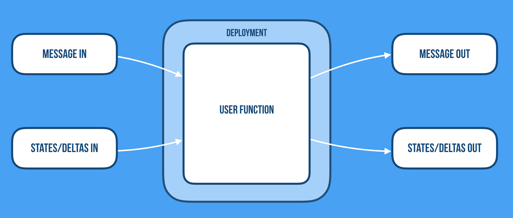

# Towards Stateful Serverless

_"We predict that serverless computing will grow to dominate the future of cloud computing."_

—Jonas et al, ['Cloud computing simplified: a Berkeley view on serverless computing'](https://arxiv.org/abs/1902.03383)

# TL;DR

*   The Serverless Developer Experience, from development to production, is revolutionary and will grow to dominate the future of Cloud Computing
    *   FaaS is however— with its ephemeral, stateless, and short-lived functions—only the first step and implementation of the Serverless Developer Experience. 
    *   FaaS is great for processing intensive, parallelizable workloads, moving data from A to B providing enrichment and transformation along the way. But it is quite limited and constrained in what use-cases it addresses well, which makes it very hard and inefficient to implement traditional application development and distributed systems protocols. 
*   What's needed is a next generation Serverless platform and programming model for  general-purpose application development (e.g. microservices, streaming pipelines, AI/ML, etc.). 
    *   One that lets us implement common use-cases such as: shopping carts, user sessions, transactions, ML models training, low-latency prediction serving, job scheduling, and much more.  
    *   What is missing is support for long-lived virtual stateful services, a way to manage distributed state in a scalable and available fashion, and options for choosing the right consistency model for the job. 
*   We are tackling these problems by attempting to build this next generation Serverless on Knative/Kubernetes, gRPC, and Akka (Cluster, Persistence, etc.), with a rich set of client APIs (JavaScript, Go, Python, Java, Scala, etc.)   

# Introduction

Bringing _stateful_ microservices, streaming, and the power of _reactive_ technologies to the Cloud Native ecosystem breaks down the final impediment standing in the way of a _Serverless platform for general-purpose application development_, true elastic scalability, and global deployment in the Kubernetes ecosystem. The marriage of Knative and Akka Cluster on Kubernetes allows applications to not only scale efficiently, but to manage distributed state reliably at scale while maintaining its global or local level of data consistency, opening up for a whole range of new addressable use-cases.

## What does Serverless mean?

Serverless means different things to different people. Many people consider it the same as Function-as-a-Service (FaaS), but we see it as much more than that: a new category of PaaS, where the key point is the Developer Experience, supporting the full life-cycle of the application, not the programming API of its latest incarnation. 

The definition from the paper[ 'Serverless computing: economic and architectural impact'](https://www.doc.ic.ac.uk/~rbc/papers/fse-serverless-17.pdf), by Adzic et al. paints a broader picture: 
> _"'Serverless' refers to a new generation of platform-as-a-service offerings where the infrastructure provider takes responsibility for receiving client requests and responding to them, capacity planning, task scheduling, and operational monitoring. Developers need to worry only about the logic for processing client requests."_

## What's wrong with Serverless? 

Serverless today is a great platform for stateless services, focusing on scaling from 1-10000 requests and down to zero, and does an amazing job doing this—at scale in a very cost-efficient manner (no events == no cost). It simplifies the delivery of scale and simplicity in operations. 

The current incarnation of Serverless, the so-called Function-as-as Service (FaaS), is a classic data-shipping architecture—we move data to the code, not the other way round. It is great for processing intensive—so-called [embarrassingly parallel](https://en.wikipedia.org/wiki/Embarrassingly_parallel)—workloads, moving data from A to B providing enrichment and transformation along the way. 

We, however, believe that Serverless is more than FaaS (which is only the first step on the journey). It's not about a specific implementation but all about the Developer Experience—a new way of building and running applications, and it's about time that we expand on its scope and supported use-cases. 

## The limitations of FaaS

One limitation of FaaS is that its functions are ephemeral, stateless, and short-lived[^1]. This makes it problematic to build general-purpose data-centric cloud-native applications since it is simply too costly — in terms of performance, latency, and throughput — to lose the computational context (locality of reference) and being forced to load and store the state from the backend storage over and over again. 

Another limitation is that often functions have no direct addressability, which means that they can't communicate directly with each other using point-to-point communication but always need to resort to publish-subscribe, passing all data over some slow and expensive storage medium. A model that can work well for event-driven use-cases but yields too high latency for addressing general-purpose distributed computing problems[^2].

## Stateful serverless computing for an event-driven data-centric world

The serverless movement today is very focused on the automation of the underlying infrastructure, but it has to some extent ignored the equally complicated requirements at the application layer, where the move towards fast data, streaming, and event-driven stateful architectures creates all sorts of new challenges for operating systems in production.

Stateless functions is a great tool that has its place in the cloud computing toolkit, but for serverless to reach the grand vision that the industry is demanding of a Serverless world while allowing us to build modern data-centric real-time applications, we can't continue to ignore the hardest problem in distributed systems: managing state—your data. 

If Serverless is conceptually about how to remove humans from the equation and solve developers' hardest problems with reasoning about systems in production, then they need declarative APIs and high-level abstractions with rich and easily understood semantics (beyond low-level primitives like functions) for working with never-ending streams of data, manage complex distributed data workflows, and managing distributed state in a reliable, resilient, scalable, and performant way. 

What we need support for is: 
*   _Stateful_ long-lived virtual _addressable_ components.[^3] 
    *   As discussed by [Hellerstein et al](https://blog.acolyer.org/2019/01/14/serverless-computing-one-step-forward-two-steps-back/): _"If the platform pays a cost to create an affinity (e.g. moving data), it should recoup that cost across multiple requests. This motivates the ability for programmers to establish software agents— call them functions, actors, services, etc.— that persist over time in the cloud, with known identities."_
*   A wider range of options for _coordination_ and _communication_ patterns (beyond event-based pub-sub over a broker), including _fine-grained sharing of state_ using common patterns like point-to-point, broadcast, aggregation, merging, shuffling, etc.
    *   As concluded by [Jonas et al](https://arxiv.org/pdf/1902.03383.pdf): _"This limitation also suggests that new variants of serverless computing may be worth exploring, for example naming function instances and allowing direct addressability for access to their internal state (e.g., Actors as a Service)"_.
*   Tools for managing _distributed state_ reliably at scale—in a durable or ephemeral fashion—with _options for consistency_ ranging from _strong_ to _eventual_ and _causal_ consistency[^4], and ways to physically co-locate code and data while remaining logically separate.
    *   As discussed by [Hellerstein et al](https://blog.acolyer.org/2019/01/14/serverless-computing-one-step-forward-two-steps-back/): _"The sequential metaphor of procedural programming will not scale to the cloud. Developers need languages that encourage code that works correctly in small, granular units— of both data and computation— that can be easily moved around across time and space."_
*   Intelligent adaptive placement of stateful functions—ways to physically co-locate code and data while remaining logically separate[^9].
*   End-to-end correctness and consistency—be able to reason about streaming pipelines and the properties[^5] and guarantees it has as a whole.
*   Predictable performance, latency, and throughput—in startup time, communication, coordination, and durable storage/access of data. 

End-to-end correctness, consistency, and safety mean different things for different services. It's totally dependent on the use-case, and can't be outsourced completely to the infrastructure. The next generation serverless implementations need to provide programming models and a holistic Developer Experience working in concert with the underlying infrastructure maintaining these properties, without continuing to ignore the hardest, and most important problem: how to manage your data in the cloud—reliably at scale.

# Enter CloudState (Serverless 2.0)

[CloudState](https://cloudstate.io) is a standards effort defining a specification, protocol, and reference implementation, aiming to extend the promise of Serverless and its Developer Experience to general-purpose application development. 

CloudState builds on and extends the traditional stateless FaaS model, by adding support for long-lived addressable stateful services and a way of accessing mapped well-formed data via [gRPC](https://grpc.io/), while allowing for a range of different consistency model—from strong to eventual consistency—based on the nature of the data and how it should be processed, managed, and stored. 

You define your data model, choose its consistency mode and resolution method, and access both your data, data-centric operations, streaming pipelines, and events via a well-formed protocol of gRPC command and read channels.

## High-level design

The CloudState reference implementation is built on top of Kubernetes, [Knative](https://cloud.google.com/knative), [Graal VM](https://www.graalvm.org), [gRPC](https://grpc.io), and [Akka](https://akka.io), with a growing set of client API libraries for different languages. Inbound and outbound communication is always going through the sidecars over gRPC channel[^6] using a constrained and well-defined protocol, in which the user defines commands in, events in, command replies out, and events out. Communicating over a gRPC allows the user code to be implemented in different languages (JavaScript, Java, Go, Scala, Python, etc.).

Each stateful service is backed by an Akka cluster of durable Akka actors (supporting several data models, storage techniques, and databases). The user, however, is shielded from these complexities through a set of sidecars bridging the user code to the backend state and cluster management. 

Managing distributed state isn't just about pushing data from A to B in a reliable fashion. It's about selecting a model that reflects the real world use of the data, and its convergence on usable consistency, not artificially enforced consistency. Being able to have data span clusters, data centers, availability zones, and continents, and maintain a useful coherent state is something that the combination of Kubernetes and Akka excel at. Additionally, repetitive work that is better executed in the stateful cluster, or needs to maintain long-running state can be embedded via command channels. 

You can read more about the design [here](TODO).

## Stateful functions are incompatible with CRUD

We need to rethink the use of CRUD in Serverless. CRUD, in the general sense, means unconstrained database access, and is too broad and open-ended to be used effectively in Serverless environments (or any general Cloud development for that matter). 

Unconstrained database access means that the user function itself needs to manage the nitty-gritty details about data access and storage, and your are thereby moving all the operational concerns from the Serverless framework into the user function. Now it's hard for the framework to know the intention of each access. For example: 

* Is the operation a read, or a write?
* Can it be cached?
* Can consistency be relaxed, or is strong consistency needed?
* Can operations proceed during partial failure? 

Instead, if we understand these properties then we can make better decisions automatically. For example: 

* Write ops are fast and read ops are slow: add more memory to DB
* Reading immutable values: add caching
* Writes must be serializable: add sharding, single writers per entity.

We all know that constraints can be liberating and this holds true for Serverless as much as anything else. As a fact, one of the reasons for the success of Serverless is that it has such a constrained developer experience, which allows you as a developer to focus on the essence: the business logic for the function. For example, Serverless has a great model for abstracting over communication where all communication is translated to receiving and emitting events. 

The question we asked ourselves was: can we abstract over state in the same way? Provide a clean and uniform abstraction of _state in_ and _state out_ for the function. 

This would allow the framework to manage durable state on behalf of the function, to monitor and manage it holistically across the whole system, and take more intelligent decisions.  

Unconstrained CRUD does not work in in this model since we can't pass the entire data set in and out of the function. What we need are data storage patterns that have constrained input/output protocols. Patterns that fall into this category are Key-Value, Event Sourcing, and CRDTs. 

In [Event Sourcing](https://martinfowler.com/eaaDev/EventSourcing.html), _state in_ is the event log while _state out_ is any newly persisted events as a result of handling a command. 

In [CRDTs](https://en.wikipedia.org/wiki/Conflict-free_replicated_data_type), _state in_ is a stream of deltas and/or state updates, and _state out_ is a stream of deltas and/or state updates.  

In Key-Value, the _state out_ is the key and _state in_ the value.

While most developers have worked with Key-Value stores, Event Sourcing and CRDTs might be a bit unfamiliar. What's interesting is that they fit an event-driven model vely well and while being on the opposite sides of the state consistency spectrum, with the former gives strong (ACID) consistency (through event logging) while the latter eventual/causal consistency. Together they give us a wide range of options for managing distributed state in a consistent fashion by allowing you to choose the optimal model for the specific use-case and data set[^7]. 

# Expanding on the use-cases for Serverless

## Use-cases FaaS addresses well

As we have discussed above, Serverless 1.0 (FaaS) is well suited for parallelizable processing-centric use-cases, where incoming data is pushed downstream through a pipeline of stateless functions doing data enrichment and transformations before pushing it downstream. 

Examples of use-cases of this are[^8]: 

*   **Embarrassingly parallel tasks**—often invoked on-demand and intermittently. For example, resizing images, performing object recognition, and running integer-programming-based optimizations.
*   **Orchestration functions**, used to coordinate calls to proprietary auto-scaling services, where the back-end services themselves do the real heavy lifting.
*   Applications that **compose chains of functions**—for example, workflows connected via data dependencies. These use cases often show high end-to-end latencies though.

As Adzic et al. write in their paper ['Serverless computing: economic and architectural impact'](http://www.doc.ic.ac.uk/~rbc/papers/fse-serverless-17.pdf): 

> _"… serverless platforms today are useful for important (but not five-nines mission critical) tasks, where high-throughput is key, rather than very low latency, and where individual requests can be completed in a relatively short time window. The economics of hosting such tasks in a serverless environment make it a compelling way to reduce hosting costs significantly, and to speed up time to market for delivery of new features."_

## New use-cases that CloudState opens up for

However, implementing traditional application development, microservices, stateful data pipelines, and general-purpose distributed system problems using stateless functions (FaaS) is very hard to do in a low-latency, performant, reliable way. 

CloudState is designed to extend the model and making it straightforward to implement use-cases such as: 

*   **Training and Serving of Machine Learning Models**
    *   Any use-case that needs to build up, and provide low latency serving of, dynamic models 
*   **Low-latency Real-time Prediction/Recommendation Serving**
*   **Low-latency Real-time Fraud Detection**
*   **Low-latency Real-time Anomaly Detection**
*   **User Session, Shopping Cart, and similar**
    *   Managing in-memory (but potentially durable) session state across the lifecycle of individual requests. A very common use-case, e.g. retail, online gaming, real-time betting, etc.
*   **Transaction and Workflow Management**
    *   Transactional distributed workflow management, such as the Saga Pattern. Manage each step in the workflow including rollback/compensating actions in the case of failure, while offering options in terms of consistency guarantees.
*   **Shared Collaborative Workspaces**
    * E.g. Collaborative Document Editing and Chat Rooms.
*   **Distributed counting, voting, etc.**
*   **Leader Election, and other distributed systems protocols for coordination**
    *   Trivial to implement with Akka Cluster/Distributed Data, while always coordinating over a distributed storage (such as DynamoDB in the case of Lambda) is too costly, slow, and can become a single point of failure.

The goal of CloudState is giving a way to implement these use-cases in a scalable and available way, working in concert with the application itself, while providing end-to-end correctness, consistency, and safety.

## Footnotes

[^1]:
     For example, Amazon Lambda caps their lifespan to 15 minutes.

[^2]:
     For a detailed discussion on this, and other limitations and problems with FaaS read the paper ["Serverless Computing: One Step Forward, Two Steps Back"](https://arxiv.org/abs/1812.03651) by Joe Hellerstein, et al.

[^3]:
     All the terms here are important, so let's clarify them. Stateful: in-memory yet durable and resilient state; Long-lived: life-cycle is not bound to a specific session, context available until explicitly destroyed; Virtual: location transparent and mobile, not bound to a physical location; Addressable: referenced through a stable address, one example of a component with these traits would be Actors

[^4]:
     For example, disorderly programming constructs like [CRDTs](https://en.wikipedia.org/wiki/Conflict-free_replicated_data_type) (discussed more below).

[^5]:
     Such as backpressure, windowing, completeness vs correctness, etc.

[^6]:
     At most one per service/entity, allowing the infrastructure to safely cache entity state in memory in the context of the gRPC stream.
     
[^7]:
     Akka Multi-DC log replication is a great example of combining the two techniques to do amazing things. 

[^8]:
     See the paper [Serverless Computing: Economic and Architectural Impact](https://blog.acolyer.org/2017/10/19/serverless-computing-economic-and-architectural-impact/).

[^9]:
      As discussed in [this article](https://medium.com/riselab/two-missing-links-in-serverless-computing-stateful-computation-and-placement-control-964c3236d18) by Stoica and Petersohn.

