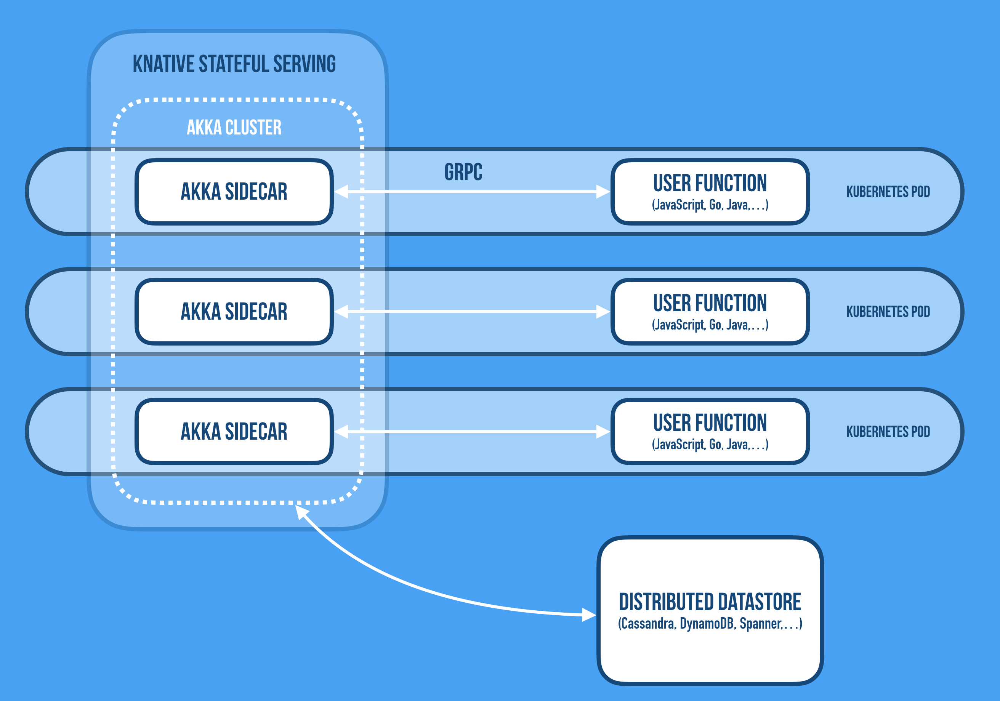

# Cloudstate - Next Generation Serverless

_"We predict that serverless computing will grow to dominate the future of cloud computing."_

—Berkeley CS dept, ['Cloud computing simplified: a Berkeley view on serverless computing'](https://arxiv.org/abs/1902.03383)

Bringing _stateful_ services, fast data/streaming, and the power of reactive technologies to the Cloud Native ecosystem breaks down the final impediment standing in the way of a **Serverless platform for general-purpose application development** — with true elastic scalability, high resilience, and global deployment, in the Kubernetes ecosystem. 

The Serverless movement today is very focused on the automation of the underlying infrastructure, but it has to some extent ignored the equally complicated requirements at the application layer, where the move towards Fast Data, streaming, and event-driven stateful architectures creates all sorts of new challenges for operating systems in production.

Stateless functions are a great tool that has its place in the cloud computing toolkit, but for Serverless to reach the grand vision that the industry is demanding of a Serverless world while allowing us to build modern data-centric real-time applications, we can't continue to ignore the hardest problem in distributed systems: managing state—your data. 

The [Cloudstate](https://cloudstate.io) project takes on this challenge and paves the way for Serverless 2.0. It consists of two things: 

1. **A standards effort** — defining a specification, protocol between the user functions and the backend, and a TCK.
2. **A reference implementation** — implementing the backend and a set of client API libraries in different languages.

Cloudstate's reference implementation is leveraging [Knative](https://cloud.google.com/knative/), [gRPC](https://grpc.io/), [Akka Cluster](https://doc.akka.io/docs/akka/current/index-cluster.html), and [GraalVM](https://www.graalvm.org/) running on [Kubernetes](https://kubernetes.io/), allowing applications to not only scale efficiently, but to manage distributed state reliably at scale while maintaining its global or local level of data consistency, opening up for a whole range of new addressable use-cases.

Join us in making this vision a reality!

---
## Table of Contents

- [Why Cloudstate?](#why-cloudstate)
    + [Limitations of current Serverless implementations](#limitations-of-current-serverless-implementations)
    + [The need for Stateful Serverless Computing](#the-need-for-stateful-serverless-computing)
    + [Enter Cloudstate - Serverless 2.0](#enter-cloudstate)
    + [Stateful functions are incompatible with CRUD](#stateful-functions-are-incompatible-with-crud)
    + [Abstracting over state](#abstracting-over-state)
    + [High-Level design](#high-level-design)
    + [Expanding on the use-cases for Serverless](#expanding-on-the-use-cases-for-serverless)
- [Design & Architecture](#design-and-architecture)
    + [High level overview](#high-level-overview)
    + [Common Intermediate Representation](#common-intermediate-representation)
    + [Kubernetes Operator](#kubernetes-operator)
    + [Support for Autoscaling](#support-for-autoscaling)
    + [Support for HTTP and JSON](#support-for-http-and-json)
    + [Supported databases](#supported-databases)
- [Samples](#samples)
- [Client API](#client-api)
    + [JavaScript API](#javascript-api)
    + [Java API](#java-api)
- [Run Cloudstate](#run-cloudstate)
- [Knative Integration](#knative-integration)
- [GraalVM Integration](#graalvm-integration)
- [Testing Strategy](#testing-strategy)
- [Get involved](#get-involved)

---
## Why Cloudstate?

### TL;DR

*   The Serverless Developer Experience, from development to production, is revolutionary and will grow to dominate the future of Cloud Computing
    *   FaaS is—with its ephemeral, stateless, and short-lived functions—merely the first step and implementation of the Serverless Developer Experience. 
    *   FaaS is great for processing intensive, parallelizable workloads, moving data from A to B providing enrichment and transformation along the way. But it is quite limited and constrained in terms of the use-cases it addresses well, which makes it difficult and inefficient to carry out traditional application development and to implement distributed systems protocols. 
*   What's needed is a next-generation Serverless platform (Serverless 2.0) and programming model for general-purpose application development (e.g. microservices, streaming pipelines, AI/ML, etc.). 
    *   One that lets us implement common use-cases such as: shopping carts, user sessions, transactions, ML models training, low-latency prediction serving, job scheduling, and much more.  
    *   What is missing is support for long-lived virtual stateful services, a way to manage distributed state in a scalable and available fashion, and options for choosing the right consistency model for the job. 
*   We are tackling these problems by building this next-generation Serverless on Knative/Kubernetes, gRPC, and Akka (Cluster, Persistence, etc.), with a rich set of client APIs (JavaScript, Go, Python, Java, Scala, PHP, etc.)   

### Limitations of current Serverless implementations 

Serverless means different things to different people. Many people consider it the same as Function-as-a-Service (FaaS). We see it as much more than that: a new category of PaaS itself, where the focal point is the Developer Experience, as well as supporting the full life-cycle of the application, and not merely the programming API of its latest incarnation. 

The definition from the paper[ 'Serverless computing: economic and architectural impact'](https://www.doc.ic.ac.uk/~rbc/papers/fse-serverless-17.pdf), by Adzic et al. paints a broader picture: 
> _"'Serverless' refers to a new generation of platform-as-a-service offerings where the infrastructure provider takes responsibility for receiving client requests and responding to them, capacity planning, task scheduling, and operational monitoring. Developers need to worry only about the logic for processing client requests."_

Serverless today is a great platform for stateless services, focusing on scaling from 1-10000 requests and down to zero, and does an amazing job doing this—at scale in a very cost-efficient manner (no events == no cost). It simplifies the delivery of scale and simplicity in operations. 

The current incarnation of Serverless, the so-called Function-as-as Service (FaaS), is a classic data-shipping architecture—we move data to the code, not the other way round. It is great for processing intensive—so-called [embarrassingly parallel](https://en.wikipedia.org/wiki/Embarrassingly_parallel)—workloads, moving data from A to B providing enrichment and transformation along the way. 

We, however, believe that Serverless is more than FaaS (which is only the first step along the journey). It's not about a specific implementation. Instead, it's all about the Developer Experience—a new way of building and running applications, and it is about time that we expand on its scope and supported use-cases. 

* One limitation of FaaS is that its functions are ephemeral, stateless, and short-lived[^1]. This makes it problematic to build general-purpose data-centric cloud-native applications since it is simply too costly — in terms of performance, latency, and throughput — to lose the computational context (locality of reference) and being forced to load and store the state from the backend storage over and over again. 

* Yet another limitation (of FaaS) is that, quite often, functions simply have no direct addressability, which means that they can't communicate directly with each other using point-to-point communication but always need to resort to publish-subscribe, passing all data over some slow and expensive storage medium. A model that can work well for event-driven use-cases but yields too high latency for addressing general-purpose distributed computing problems[^2].

### The need for Stateful Serverless Computing

If Serverless is conceptually about how to remove humans from the equation and solve developers' hardest problems with reasoning about systems in production, then they need declarative APIs and high-level abstractions with rich and easily understood semantics (beyond low-level primitives like functions) for working with never-ending streams of data, manage complex distributed data workflows, and managing distributed state in a reliable, resilient, scalable, and performant way. 

What we need support for is: 

*   _Stateful_ long-lived virtual _addressable_ components.[^3] 
    *   As discussed by [Hellerstein et al](https://blog.acolyer.org/2019/01/14/serverless-computing-one-step-forward-two-steps-back/): _"If the platform pays a cost to create an affinity (e.g. moving data), it should recoup that cost across multiple requests. This motivates the ability for programmers to establish software agents— call them functions, actors, services, etc.— that persist over time in the cloud, with known identities."_
*   A wider range of options for _coordination_ and _communication_ patterns (beyond event-based pub-sub over a broker), including _fine-grained sharing of state_ using common patterns like point-to-point, broadcast, aggregation, merging, shuffling, etc.
    *   As concluded by [Jonas et al](https://arxiv.org/pdf/1902.03383.pdf): _"This limitation also suggests that new variants of serverless computing may be worth exploring, for example naming function instances and allowing direct addressability for access to their internal state (e.g., Actors as a Service)"_.
*   Tools for managing _distributed state_ reliably at scale—in a durable or ephemeral fashion—with _options for consistency_ ranging from _strong_ to _eventual_ and _causal_ consistency[^4], and ways to physically co-locate code and data while remaining logically separate.
    *   As discussed by [Hellerstein et al](https://blog.acolyer.org/2019/01/14/serverless-computing-one-step-forward-two-steps-back/): _"The sequential metaphor of procedural programming will not scale to the cloud. Developers need languages that encourage code that works correctly in small, granular units— of both data and computation— that can be easily moved around across time and space."_
*   Intelligent adaptive placement of stateful functions—ways to physically co-locate code and data while remaining logically separate[^9].
*   End-to-end correctness and consistency—be able to reason about streaming pipelines and the properties[^5] and guarantees it has as a whole.
*   Predictable performance, latency, and throughput—in startup time, communication, coordination, and durable storage/access of data. 

End-to-end correctness, consistency, and safety mean different things for different services. It's totally dependent on the use-case, and can't be outsourced completely to the infrastructure. The next-generation serverless implementations need to provide programming models and a holistic Developer Experience working in concert with the underlying infrastructure maintaining these properties, without continuing to ignore the hardest, and most important problem: how to manage your data in the cloud—reliably at scale.

### Enter Cloudstate

[Cloudstate](https://cloudstate.io) is a standards effort defining a specification, protocol, and reference implementation, aiming to extend the promise of Serverless and its Developer Experience to general-purpose application development. 

Cloudstate builds on and extends the traditional stateless FaaS model, by adding support for long-lived addressable stateful services and a way of accessing mapped well-formed data via [gRPC](https://grpc.io/), while allowing for a range of different consistency model—from strong to eventual consistency—based on the nature of the data and how it should be processed, managed, and stored. 

You define your data model, choose its consistency mode and resolution method, and access both your data, data-centric operations, streaming pipelines, and events via a well-formed protocol of gRPC command and read channels.

### Stateful functions are incompatible with CRUD

We need to rethink the use of CRUD in Serverless. CRUD, in the general sense, means unconstrained database access, and is too broad and open-ended to be used effectively in Serverless environments (or any general Cloud development for that matter). 


Unconstrained database access means that the user function itself needs to manage the nitty-gritty details about data access and storage, and you are thereby moving all the operational concerns from the Serverless framework into the user function. Now it's hard for the framework to know the intention of each access. For example: 

* Is the operation a read, or a write?
* Can it be cached?
* Can consistency be relaxed, or is strong consistency needed?
* Can operations proceed during partial failure? 

Instead, if we understand these properties then we can make better decisions automatically. For example: 

* Write ops are fast and read ops are slow: add more memory to DB
* Reading immutable values: add caching
* Writes must be serializable: add sharding, single writers per entity.

### Abstracting over state

We all know that constraints can be liberating and this holds true for Serverless as much as anything else. As a fact, one of the reasons for the success of Serverless is that it has such a constrained developer experience, which allows you as a developer to focus on the essence: the business logic for the function. For example, Serverless has a great model for abstracting over communication where all communication is translated to receiving and emitting events. 

The question we asked ourselves was: can we abstract over state in the same way? Provide a clean and uniform abstraction of _state in_ and _state out_ for the function. 


This would allow the framework to manage durable state on behalf of the function, to monitor and manage it holistically across the whole system, and make more intelligent decisions.  

Unconstrained CRUD does not work in this model since we can't pass the entire data set in and out of the function. What we need are data storage patterns that have constrained input/output protocols. Patterns that fall into this category are Key-Value, Event Sourcing, and CRDTs. 

In [Event Sourcing](https://martinfowler.com/eaaDev/EventSourcing.html), _state in_ is the event log while _state out_ is any newly persisted events as a result of handling a command. 


In [CRDTs](https://en.wikipedia.org/wiki/Conflict-free_replicated_data_type), _state in_ is a stream of deltas and/or state updates, and _state out_ is a stream of deltas and/or state updates.  


In Key-Value, the _state out_ is the key and _state in_ the value.

While most developers have worked with Key-Value stores, Event Sourcing and CRDTs might be a bit unfamiliar. What's interesting is that they fit an event-driven model very well while being on opposite sides of the state consistency spectrum, with the former providing strong (ACID) consistency (through event logging) and the latter providing eventual/causal consistency. Taken together, they give us a truly wide range of options for managing distributed state in a consistent fashion by allowing you to choose the optimal model for your specific use-case and data set[^7]. 

### High-level design

The Cloudstate reference implementation is built on top of Kubernetes, [Knative](https://cloud.google.com/knative), [Graal VM](https://www.graalvm.org), [gRPC](https://grpc.io), and [Akka](https://akka.io), with a growing set of client API libraries for different languages. Inbound and outbound communication is always going through the sidecars over gRPC channel[^6] using a constrained and well-defined protocol, in which the user defines commands in, events in, command replies out, and events out. Communicating over a gRPC allows the user code to be implemented in different languages (JavaScript, Java, Go, Scala, Python, etc.).


Each stateful service is backed by an Akka cluster of durable Akka actors (supporting several data models, storage techniques, and databases). The user, however, is shielded from these complexities through a set of sidecars bridging the user code to the backend state and cluster management. 



Managing distributed state isn't just about pushing data from A to B in a reliable fashion. It's about selecting a model that reflects the real world use of the data, and its convergence on usable consistency, not artificially enforced consistency. Being able to have data span clusters, data centers, availability zones, and continents, and maintain a useful coherent state is something that the combination of Kubernetes and Akka excel at. Additionally, repetitive work that is better executed in the stateful cluster, or needs to maintain long-running state can be embedded via command channels. 

You can read more about the design [here](#design-and-architecture).

### Expanding on the use-cases for Serverless

#### Use-cases FaaS addresses well

As we have discussed above, Serverless 1.0 (FaaS) is well suited for parallelizable processing-centric use-cases, where incoming data is pushed downstream through a pipeline of stateless functions doing data enrichment and transformations before pushing it downstream. 

Examples of use-cases of this are[^8]: 

*   **Embarrassingly parallel tasks**—often invoked on-demand and intermittently. For example, resizing images, performing object recognition, and running integer-programming-based optimizations.
*   **Orchestration functions**, used to coordinate calls to proprietary auto-scaling services, where the back-end services themselves do the real heavy lifting.
*   Applications that **compose chains of functions**—for example, workflows connected via data dependencies. These use cases often show high end-to-end latencies though.

As Adzic et al. write in their paper ['Serverless computing: economic and architectural impact'](http://www.doc.ic.ac.uk/~rbc/papers/fse-serverless-17.pdf): 

> _"… serverless platforms today are useful for important (but not five-nines mission critical) tasks, where high-throughput is key, rather than very low latency, and where individual requests can be completed in a relatively short time window. The economics of hosting such tasks in a serverless environment make it a compelling way to reduce hosting costs significantly, and to speed up time to market for delivery of new features."_

#### New use-Cases that Cloudstate enables

However, implementing traditional application development, microservices, stateful data pipelines, and general-purpose distributed system problems using stateless functions (FaaS) is very hard to do in a low-latency, performant, reliable way. 

Cloudstate is designed to extend the model and make it straightforward to implement use-cases such as: 

*   **Training and Serving of Machine Learning Models**
    *   Any use-case that needs to build up, and provide low latency serving of, dynamic models 
*   **Low-latency Real-time Prediction/Recommendation Serving**
*   **Low-latency Real-time Fraud Detection**
*   **Low-latency Real-time Anomaly Detection**
*   **User Session, Shopping Cart, and similar**
    *   Managing in-memory (but potentially durable) session state across the lifecycle of individual requests. A very common use-case, e.g. retail, online gaming, real-time betting, etc.
*   **Transaction and Workflow Management**
    *   Transactional distributed workflow management, such as the Saga Pattern. Manage each step in the workflow including rollback/compensating actions in the case of failure, while offering options in terms of consistency guarantees.
*   **Shared Collaborative Workspaces**
    * E.g. Collaborative Document Editing and Chat Rooms.
*   **Distributed counting, voting, etc.**
*   **Leader Election, and other distributed systems protocols for coordination**
    *   Trivial to implement with Akka Cluster/Distributed Data, while always coordinating over a distributed storage (such as DynamoDB in the case of Lambda) is too costly, slow, and can become a single point of failure.

The goal of Cloudstate is to provide a way for implementing these use-cases in a scalable and available way, working in concert with the application itself, all the while providing end-to-end correctness, consistency, and safety.

---
## Design and architecture

Note: The design will most likely change as the project evolves.

### High level overview

A Cloudstate service looks like this:


* **Ingress** - This can be Istio, Knative, or just regular ClusterIP service communication in Kubernetes. Whatever service approach is used, Cloudstate expects traffic to be load balanced across its pods randomly and evenly.
* **Akka Sidecar** - This sidecar is injected by the Cloudstate operator. All requests go through it. The sidecars of a single Cloudstate service form a cluster, communicating directly with each other using Akka remoting. This cluster, and the communication links between the sidecars, allows for sharding and replication of state, along with addressed P2P messaging between pods.
* **Code** - This is the function implemented by the developer. It can be written in any language that supports gRPC. The Akka sidecars communicate with the user functions using a predefined gRPC protocol. This protocol carries both incoming requests and outgoing responses, as well as messages conveying the current state of the system. Typically, Cloudstate will provide support libraries for each language that adapt the gRPC protocol to an idiomatic API for that language.
* **Distributed Datastore** - When a service needs to persist state (such as when implementing Event Sourced entities), this state will be persisted to a distributed datastore. It is important to note, the user code does not interact directly with the datastore - it interacts with the Akka sidecars, and the Akka sidecars communicate with the datastore. This way, all database communication can be directly managed and monitored by the Akka sidecar. And since this is done through the provision of high level patterns, assumptions can be made that allow the sidecars to safely cache, shard, and replicate data across the cluster.

### Common Intermediate Representation

The gRPC protocol spoken between the Akka sidecar and the user code is a Common Intermediate Representation (IR) as defined by Hellerstein et. al. in [Serverless Computing: One Step Forward, Two Steps Back](http://cidrdb.org/cidr2019/papers/p119-hellerstein-cidr19.pdf). This is used to allow user functions to take advantage of the features afforded by distributed systems technologies such as Akka, without needing to be written in the same language as those technologies. The protocol also allows the sidecar to be implemented using any technology, not just Akka. Cloudstate's Akka based implementation is provided as a reference implementation.

* There are two parts to the IR.

* The first is **discovery:** This is where a user function declares what services it wishes to expose, and what stateful features it needs those services to be enriched with. This is done by the sidecar making a call on the user function, using the IR protocol, to request a descriptor that describes it. This descriptor contains a serialized protobuf definition of the services that the user function wishes to expose. Each service is declared to have a particular entity type, supported types include Event Sourcing and CRDTs.

* The second part of the IR is **a pluggable entity type protocol:** Each entity type defines its own gRPC protocol for communicating between the sidecar and the user function. Here is a snippet of the event sourcing protocol:

```proto
service EventSourced {
    rpc handle(stream EventSourcedStreamIn) returns (stream EventSourcedStreamOut) {}
}

message EventSourcedStreamIn {
    oneof message {
        EventSourcedEvent event = 1;
        Command command = 2;
    }
}

message EventSourcedStreamOut {
    oneof message {
        EventSourcedReply reply = 1;
        Failure failure = 2;
    }
}

message EventSourcedReply {
    oneof response {
        Reply reply = 1;
        Forward forward = 2;
    }
    repeated google.protobuf.Any events = 3;
}
```

When a command for an entity arrives, the following messages are sent using this protocol:

1. If there is no existing `handle` stream for that entity, the `handle` streamed call is invoked. This stream will be kept open as long as more commands arrive for that entity, after a period of inactivity, the stream will be shut down.
2. The sidecar loads the event journal for that entity, and passes each event to the user function using the `EventSourcedEvent` message.
3. Once the entities event journal has been replayed, the command is sent to the user function.
4. The user function processes the command, and responds with an `EventSourcedReply`. This contains one of two responses, a `Reply` to send to the original source, or a `Forward` to forward processing to another entity. It also contains zero or more events to be persisted. These events will be persisted before the reply or forward is sent.
5. Subsequent commands may be received while the entity stream is still active, these can be processed without replaying the event journal.

The user function is expected to hold the current state of the entity in the context of the streamed function call.

The `Command` message contains, among other things, the name of a gRPC rpc call that is being invoked - this RPC call was declared during the discovery phase. It also contains the payload of that gRPC call, along with an extracted entity id, that identifies which entity the call is for. Entity ids are declared through the use of a Protobuf field extension, here is an example user function message that declares an entity id:

```proto
message AddLineItem {
    string user_id = 1 [(.cloudstate.entity_key) = true];
    string product_id = 2;
    string name = 3;
    int32 quantity = 4;
}
```

### Kubernetes Operator

Deployment of Cloudstate entities is designed to work either in a stand alone fashion, or integrating with Knative. The design allows for integrations with other serverless technologies to be implemented in future.

An operator is provided that transforms either the Cloudstate entity CRD, or the Knative Revision, into a kubernetes Deployment, which is configured with the Akka sidecar container injected, and the necessary RBAC permissions are created to allow cluster discovery, bootstrapping and formation, along with autoscaling.

Integration with Knative currently requires a fork of Knative that makes deployers pluggable. The changes necessary can be found in [this pull request](https://github.com/knative/serving/pull/4152).

### Support for Autoscaling

Experiments with the Knative autoscaler have found that it is not suitable for scaling Akka clusters. Problems include:

* Scaling up an Akka cluster is not free. When a new node is added, shards are rebalanced to it, and state is replicated to it. Starting too many nodes at once, or starting nodes only to immediately stop them, will significantly degrade throughput and performance. The Knative autoscaler does not take this into consideration, and happily starts and stops many nodes very frequently.
* Particularly when CPU is constrained, JVM warmup/jitting can take a long time, and this warmup time needs to be taken into consideration before making further scaling decisions. Additionally, it takes time to replicate state and rebalance shards to a newly started node. The JVM warmup/jitting issues we hope to address by using Graal AOT compilation with SubstrateVM.
* The Knative proxy, which the Akka sidecar replaces, is highly coupled to the Knative autoscaler, and the interface between them is not well defined, making reliance on it from the Akka sidecar high risk in terms of future evolution of Knative.

For these reasons, we have implemented our own autoscaler. For simplicity, this autoscaler is implemented as a cluster singleton in the Akka sidecar cluster - Akka cluster remoting makes propagation of metrics from all nodes to the autoscaler singleton trivial. We collect the following metrics:

* Average request concurrency per pod - this is the number of simultaneous requests being handled from outside the service. This includes requests currently being handled by user functions, requests being routed through other nodes for sharding, and requests currently interacting with the database.
* Average user function concurrency per pod - this is the number of simultaneous requests that the user function is handling.
* Average database concurrency per pod - this is the number of simultaneous operations being performed on the database at any one time. This is typically subtracted from request concurrency so that database performance does not impact decisions made based on request concurrency.
* Request rate - this is the rate at which incoming requests are arriving.

In general, scaling decisions are made when user function concurrency and request concurrency exceed or drop below configurable thresholds. The reason for using two metrics is that in sharding situations, request concurrency is highly dependent on the number of nodes. 
* When there is only one node, no requests are forwarded to other nodes, which means latency stays very low, which means request concurrency stays very low. 
* When there are two nodes, on average 50% of requests are forwarded to other nodes, when there are many nodes, this number increases. 
* For this reason, request concurrency is not a good metric to base scaling decisions on when the number of nodes is low, so user function concurrency is used. However, request concurrency is still an important metric because the impact of cluster sharding on the load being handled is non zero, and indeed, if it performs badly compared to the user function, then user function concurrency will stay low, while requests back up in cluster sharding buffers.
* Hence, request concurrency is used as scaling metric, but set to something high that would never be triggered when there's only one node, but is more likely to be triggered when load is higher.

After a scaling decision has been made, the autoscaler enters a configurable stable waiting period. During this period, no concurrency based scaling decisions will be made - since it can take time for a new node to start and warm up, and therefore it will take time for concurrency to stabilise. Without the stable waiting period, a sudden increase in load will cause concurrency to increase linearly, and the autoscaler will start more and more nodes to handle this increasing concurrency. The new nodes will initially cause performance to degrade, as they warm up and have shards rebalanced to them, causing further scaling, which causes a feedback loop that sees nodes scaled to impractical numbers.

During the waiting period, however, load may continue to increase, and we want to be able to respond to that. To detect increases in load, the incoming request rate is recorded when the autoscaler first enters the stable waiting period when scaling up. If this incoming request rate increases by a configurable threshold, further scaling decisions are made.

This request rate based scaling is not used when scaling down, since the request rate when scaling down may be very low (for example, 0), making it impossible to reason about what an appropriate number of nodes to handle that request rate is. Instead, scaling down stable periods are much shorter than scaling up stable periods.

When an upgrade is detected, request rate based scaling decisions are also made, since upgrades cause a temporary degradation in performance as state is replicated and rebalanced to newly upgraded nodes.

At time of writing, the autoscaler only works in standalone mode, which uses one deployment per user function. Support for Knative's one deployment per revision of a user function has not yet been implemented, nor has support in Knative to disable the Knative autoscaler when a custom deployer is used.

### Support for HTTP and JSON

The Akka sidecar supports serving the gRPC user functions services both as gRPC, as well as using HTTP/JSON, using the [gRPC HTTP extensions](https://cloud.google.com/service-infrastructure/docs/service-management/reference/rpc/google.api##http).

### Database support

The Cloudstate Proxy Reference Implementation supports a number of databases. The table below indicates the range of support, the columns are explained as follows:

Journal
: Whether event sourced journals are supported with this database. The RI event sourcing support is built using [Akka Persistence](https://doc.akka.io/docs/akka/current/persistence.html) for the durable storage, which has support for a [wide range](https://index.scala-lang.org/search?topics=akka-persistence) of NoSQL and SQL databases.

Key-Value
: Whether Key-Value support is implemented for this database. Key-Value support is not yet provided by the Cloudstate proxy, but will be in future.

Native Image
: Whether a GraalVM Native Image build is available for the Cloudstate Proxy for this database. It can be a considerable amount of effort getting a GraalVM native image working for any library, so not all proxies support it.

| Database   | Journal            | Key-Value | Native image       |
|------------|--------------------|-----------|--------------------|
| Cassandra  | :heavy_check_mark: | :x:       | :heavy_check_mark: |
| Postgresql | :heavy_check_mark: | :x:       | :x:                |

---
## Samples

We have created a sample application in each of the supported client languages. They are all speaking the same protocol, and use the same datatypes, and can therefore be used in concert in a polyglot fashion. 

The sample application implements a simple chat application, and currently there's only one feature: user presence. But in future we will add chat room support, push notifications for chat messages, etc.

The application has two components, a presence stateful function, which uses a vote CRDT to store whether a user is currently online or not, and a gateway, which is an express/ws application, that serves a UI.

The UI is designed to allow connecting multiple users in one browser window, this is for demonstration purposes, to make it straightforward to see real time interactions, serverside pushes etc, without needing to open many browser tabs.

Check out the samples project here, with instructions on how to run them on Kubernetes: 
- [JavaScript sample](https://github.com/cloudstateio/samples-js-chat)
- [Java sample](https://github.com/cloudstateio/samples-java-chat)

### Building and publishing a sample application

The sample application is packaged in a Docker container and pushed to the Docker repository path formed using the system properties `docker.registry` and `docker.username`. The default repository path is `cloudstateio/<application-name>:tag`

For building and pushing the application (in this example the Scala shopping cart sample) to the configured docker repository:

    sbt scala-shopping-cart/docker:publish

Building and pushing the application, overriding the repository path.

    sbt scala-shopping-cart/docker:publish -Ddocker.registry=<MY-REGISTRY> -Ddocker.username=<MY-REPOSITORY>

Building the application without pushing it to the remote repository.

    sbt scala-shopping-cart/docker:publishLocal


---
## Client API

TODO: introduction to client APIs, discuss gRPC protocol, polyglot, common features, etc.

### JavaScript API

TODO: add general docs

### Java API

TODO: add general docs

---
## Run Cloudstate

### Run on GKE

1. Create a GKE cluster. We recommend at least 6 vCPUs (ie, a node pool of 3 `n1-standard-2` nodes). Also ensure that the current user is a cluster admin. Detailed instructions for creating the GKE cluster can be found in the [Knative documentation](https://github.com/knative/docs/blob/master/docs/install/Knative-with-GKE.md), follow all the steps up to (but not including) installing Knative.
2. If using an event sourced entity, install Cassandra. This can be done from the Google Marketplace, by visiting the [Cassandra Cluster](https://console.cloud.google.com/marketplace/details/google/cassandra), selecting configure, selecting your GCloud project, and then installing it in the Kubernetes cluster you just created. The defaults should be good enough, in our examples we called the app instance name `cassandra`. Note there is an option to use an in memory store if you just want to test it out, of course, as soon as your pods shut down (or if they are rebalanced), your store will be lost.
3. Create the `cloudstate` namespace and install the Cloudstate operator:

    ```
    kubectl create namespace cloudstate
    kubectl apply -n cloudstate -f https://raw.githubusercontent.com/cloudstateio/cloudstate/master/operator/cloudstate.yaml
    ```
    
You are now ready to install an event sourced function. We have a shopping cart example in the `samples/js-shopping-cart` directory of this project. This can be installed by following these instructions:

1. Configure a Cassandra store. If you called your Cassandra deployment `cassandra` and deployed it to the default namespace, this can be installed by running:

    ```
    kubectl apply -f https://raw.githubusercontent.com/cloudstateio/cloudstate/master/samples/js-shopping-cart/cassandra-store.yaml
    ```
    
    Otherwise, download the above file and update the `service` parameter to match the first node of your Cassandra stateful set.
    
2. Install the shopping cart, this can be done by running:

    ```
    kubectl apply -f https://raw.githubusercontent.com/cloudstateio/cloudstate/master/samples/js-shopping-cart/js-shopping-cart.yaml
    ```
    
The operator will install a service, you can then create an ingress for that service. To test, instantiate a gRPC client in your favourite language for [this descriptor](protocols/example/shoppingcart/shoppingcart.proto). You may need to also download the [`cloudstate/entity.proto`](https://raw.githubusercontent.com/cloudstateio/cloudstate/master/protocols/protocol/cloudstate/entity.proto) and [`google/protobuf/empty.proto`](https://raw.githubusercontent.com/protocolbuffers/protobuf/master/src/google/protobuf/empty.proto) descriptors to compile it in your language. The shopping cart descriptor is deployed with debug on, so try getting the logs of the `shopping-cart` container in each of the deployed pods to see what's happening when commands are sent.

### Points of interest in the code

We'll start with the user function, which can be found in [`samples/js-shopping-cart`](samples/js-shopping-cart). The following files are interesting:

* [`shoppingcart.proto`](protocols/example/shoppingcart/shoppingcart.proto) - This is the gRPC interface that is exposed to the rest of the world. The user function doesn't implement this directly, it passes it to the Akka backend, that implements it, and then proxies all requests to the user function through an event sourcing specific protocol. Note the use of the `cloudstate.entity_key` field option extension, this is used to indicate which field(s) form the entity key, which the Akka backend will use to identify entities and shard them.
* [`domain.proto`](protocols/example/shoppingcart/persistence/domain.proto) - These are the protobuf message definitions for the domain events and state. They are used to serialize and deserialize events stored in the journal, as well as being used to store the current state which gets serialized and deserialized as snapshots when snapshotting is used.
* [`shoppingcart.js`](samples/js-shopping-cart/shoppingcart.js) - This is the JavaScript code for implementing the shopping cart entity user function. It defines handlers for events and commands. It uses the `cloudstate-event-sourcing` Node.js module to actually implement the event sourcing protocol.

Onto the `cloudstate-event-sourcing` Node module, which can be found in [`node-support`](node-support). While there's no reason why the user function couldn't implement the event sourcing protocol directly, it is a little low level. This library provides an idiomatic JavaScript API binding to the protocol. It is expected that such a library would be provided for all support languages.

* [`entity.proto`](protocols/protocol/cloudstate/entity.proto) - This is the protocol that is implemented by the library, and invoked by the Akka backend. Commands, replies, events and snapshots are serialized into `google.protobuf.Any` - the command payloads and reply payloads are the gRPC input and output messages, while the event and snapshot payloads are what gets stored to persistence. The `ready` rpc method on the `Entity` service is used by the Akka backend to ask the user function for the gRPC protobuf descriptor it wishes to be served, this uses `google.protobuf.FileDescriptorProto` to serialize the descriptor.
* [`eventsourced.js`](node-support/src/eventsourced.js) - This is the implementation of the protocol, which adapts the protocol to the API used by the user function.

Next we'll take a look at the Akka proxy, which can be found in [`proxy/core`](proxy/core).

* [`Serve.scala`](proxy/core/src/main/scala/io/cloudstate/proxy/Serve.scala) - This provides the dynamically implemented gRPC interface as specified by the user function. Requests are forwarded as commands to the cluster sharded persistent entities.
* [`EventSourcedEntity.scala`](proxy/core/src/main/scala/io/cloudstate/proxy/eventsourced/EventSourcedEntity.scala) - This is an Akka persistent actor that talks to the user function via the event sourcing gRPC protocol.
* [`CloudStateProxyMain.scala`](proxy/core/src/main/scala/io/cloudstate/proxy/CloudStateProxyMain.scala) - This pulls everything together, starting the Akka gRPC server, cluster sharding, and persistence.
* [`HttpApi.scala`](proxy/core/src/main/scala/io/cloudstate/proxy/HttpApi.scala) - This reads [google.api.HttpRule](protocols/frontend/google/api/http.proto) annotations to generate HTTP/1.1 + JSON endpoints for the gRPC service methods.

---
## Knative integration

This page serves to outline a potential way that Stateful Serverless might integrate with Knative. This includes potential modifications necessary to Knative.

It assumed that the reader is familiar with Knative, in particular, they have read and understood the Knative serving [overview](https://github.com/knative/serving/blob/master/docs/spec/overview.md) and [spec](https://github.com/knative/serving/blob/master/docs/spec/spec.md), and therefore are familiar with Knative `Services`, `Configurations`, `Revisions` and `Routes`.

It's also assumed that the reader is familiar with the Stateful Serverless project. [This screencast](https://www.youtube.com/watch?v=AOY8yRC6dVY) introduces the project. In particular, familiarity with the `EventSourcedService` CRD shown in use [here](https://github.com/lightbend/stateful-serverless/blob/f9da1a2b7272733cba94e504c76bd7fca3355c68/src/samples/js-shopping-cart/eventsourced.yaml) will demonstrate how some of the requirements for this project have been solved in a non Knative based deployment.

### Goals with the Knative integration

The primary goal is that Stateful Serverless functions are deployed and managed just like any other Knative function, by deploying a Knative `Service`, which results in a Knative `Route` and `Configuration` being created, each change to `Configurations` results in a new Knative `Revision` being created, and then `Revisions` get deployed as replica sets according to `Route` configuration and load. Ideally, as much of Knative serving as possible should be used by stateful serverless functions, so that the differences between maintaining and deploying Stateful Serverless functions, and Knative functions, is minimal.

### Requirements for Stateful Serverless

Stateful serverless has two primary requirements:

* The ability specify Stateful Serverless specific configuration for a function (ie, a `Configuration`, and therefore also a `Service`). For example, this includes database configuration, such as [this](https://github.com/lightbend/stateful-serverless/blob/f9da1a2b7272733cba94e504c76bd7fca3355c68/src/samples/js-shopping-cart/eventsourced.yaml##L12-L23).
* The ability to replace the Knative serving sidecar with a Stateful Serverless (Akka) side car, configured according to the custom Stateful Serverless configuration. Ideally, this should be done via a high level configuration item, which a (custom) operator translates to the necessary container spec for the sidecar.

The above should work alongside regular Knative serving functions, that is to say, whether the Stateful Serverless or regular Knative serving sidecar is used should be selected on a `Configuration` by `Configuration` basis.

### Possible design

Here we propose a design, with a focus on what changes would be needed in Knative to support it.

#### Custom configuration

One configuration mechanism that would work today for supplying custom configuration would be to use custom annotations in the template spec. These should be passed on from `Service` to `Configuration` to `Revision`, and therefore can be read by whatever component is configuring the Akka sidecar.

However, this isn't ideal, as such configuration may be better described, from the developers perspective, in structured YAML/json, as shown [here](https://github.com/lightbend/stateful-serverless/blob/f9da1a2b7272733cba94e504c76bd7fca3355c68/src/samples/js-shopping-cart/eventsourced.yaml##L12-L23). To support this, Knative would need to ensure that the custom configuration is passed from Service to `Configuration` to `Revision`. Here are two ideas for how this could be done:

1. Any unknown top level properties on the Service or `Configuration` specs should not be ignored, instead, they should be read and passed as is down to the `Configuration`/`Revision`. Any changes to top level properties, including additions/removals, or changes in the nested structures, would result in a new `Revision` being created.
2. A custom configuration property, eg `customConfig`, could be defined, which Knative treats as an opaque YAML/json object that it passes as is from Service to `Configuration`, and any changes to it results in a new `Revision` with that config in it. `customConfig` may be a bad name, another name could be `module`, with a convention that any custom modules (eg stateful serverless) selects a name under that, and puts all its configuration under that name.

Option 1 may feel more natural from the developers perspective (they don't care if the config is custom or not), however, it does mean that typos will be harder to diagnose, as they will be passed as is down the chain, and it will be less obvious that the typos are being ignored. Option 2 is more future proofed, since it contains all custom configuration to the custom config namespace, thereby ensuring future changes to the serving CRDs will not conflict with any custom configuration.

#### Custom sidecar injection

TODO: We've made an assumption that Knative is using `Deployments` for this. But maybe it's not; maybe it's using `ReplicaSets`; or maybe it's using something else altogether.

The Knative operator is responsible for translating `Revisions` into `Deployments`. As part of this, it injects the Knative sidecar into the template spec. This translation needs to be disabled, and Stateful Serverless needs to provide its own operator that watches `Revisions`, and translates the ones that it is responsible for into `Deployments`, including the injection of its own sidecar.

To support this, an annotation could be used (as the flag to disable it), but as discussed in [Custom configuration](##custom-configuration), this is not ideal. An alternative solution is to add a new configuration parameter to the `Service`, `Configuration` and `Revision` specs. This could be called `moduleName`, which could default to `knative` and would indicate that `knative` is going to do the translation. Any value other than `knative` will indicate that Knative should not do the translation. If following the suggestion of using a `module` property for the custom configuration, then the custom configuration could be made to live under a property that is equal to the `moduleName`.

### Additional notes

#### Knative Build

Knative Build has not yet been taken into consideration, and I haven't even looked at how it works. Investigation needs to be done to ensure that this approach will be compatible with the current Knative Build workflow.

#### Routing, updates, and canary deployments

Stateful Serverless deployments will form a cluster involving all pods for the service. This applies across revisions. This is necessary: For example, event sourcing requires that each entity live on at most one node to ensure strong consistency of command-handling on that node. As such, when a new revision is deployed, and an update is underway, new nodes for the new revision need to join the cluster of existing nodes (from the old revision). Otherwise, entities could be started in both clusters.

This presents an interesting conflict with canary deployments and routing. For cluster sharded entities, Akka will by default attempt to distribute load evenly across all nodes in the cluster. So if there are two existing nodes, and an update is done, using a canary deployment that initially routes 5% of the traffic to the new node, Akka's cluster sharding will make that 5% irrelevant, and one third of the traffic will end up being handled by the new node. Furthermore, the 5% of traffic that is routed to the new node may or may not end up being handled by that node.

The Akka sidecar will need to be careful to ensure that metrics collection is done post cluster sharding. Assuming that Knative's canary deployment support uses the metrics reported by the sidecars to decide on the health of the canary node, this should ensure that canary deployments still work as intended. If not, if for example metrics reported by the service mesh are used, then that may need to be modified to support this.

A custom Akka cluster sharding rebalancing strategy may be able to be used to try and replicate traffic routing percentages. Perhaps the biggest unanswered question there is how the strategy would discover the current required percentages.

---
## GraalVM integration

By default, we build a GraalVM native image for Linux. This is done inside a Docker container and so can be done on any platform with Docker installed. We also generate Docker images containing the native image, so the native image can be run on any platform using Docker too.

For further information about setting up the build environment, see [The Cloudstate Build](https://cloudstate.io/docs/developer/thebuild.html#the-cloudstate-build) documentation.

### Building the native image

If you simply want to run the native image locally, you can use the following command:

```
sbt "dockerBuildDevMode publishLocal"
```

This will take 5 or more minutes. Among the output you should see the result of the native image build, for example:

```bash
…
[info] [cloudstate-proxy-core:34956]    classlist:  23,867.63 ms
[info] [cloudstate-proxy-core:34956]        (cap):   1,402.66 ms
[info] [cloudstate-proxy-core:34956]        setup:   3,183.02 ms
[info] [cloudstate-proxy-core:34956]   (typeflow): 106,110.90 ms
[info] [cloudstate-proxy-core:34956]    (objects):  62,919.78 ms
[info] [cloudstate-proxy-core:34956]   (features):   8,452.19 ms
[info] [cloudstate-proxy-core:34956]     analysis: 185,664.30 ms
[info] [cloudstate-proxy-core:34956]     (clinit):   4,669.41 ms
[info] [cloudstate-proxy-core:34956]     universe:   7,296.91 ms
[info] [cloudstate-proxy-core:34956]      (parse):   9,460.94 ms
[info] [cloudstate-proxy-core:34956]     (inline):  11,308.08 ms
[info] [cloudstate-proxy-core:34956]    (compile):  43,680.43 ms
[info] [cloudstate-proxy-core:34956]      compile:  68,467.83 ms
[info] [cloudstate-proxy-core:34956]        image:   5,779.23 ms
[info] [cloudstate-proxy-core:34956]        write:   1,930.98 ms
[info] [cloudstate-proxy-core:34956]      [total]: 296,677.26 ms
[success] Total time: 304 s, completed Aug 6, 2019 4:00:02 PM
```

The resulting Docker image is `cloudstate-proxy-dev-mode:latest`.

This image is a dev mode image, it uses an in memory store, and forms a single cluster by itself. You can also run `dockerBuildNoStore` and `dockerBuildInMemory`, `dockerBuildCassandra` to build a production proxy that has no store, an in memory store or Cassandra store respectively. These will attempt the Kubernetes cluster bootstrap process, so can only be used in Kubernetes with appropriate environment variables set to help them discover other pods in the same deployment.

Substituting `publishLocal` for `publish` will push the docker images to a remote Docker registry, to enable this the `-Ddocker.registry` and `-Ddocker.username` flags must be specified to the `sbt` command.

### Running the docker image

The docker image can be run by running `docker run cloudstate-proxy-dev-mode`. However, by itself this won't be useful because the container won't be able to locate the user function from its container. If running the user function locally and your platform is Linux, then this can be enabled simply by passing the `--network=host` flag to use the hosts network namespace.

For all other platforms, the simplest way is to run the user function in a docker container, and share the network namespaces between the two containers. The `js-shopping-cart` sample app docker image can be built by running `npm run dockerbuild` from the `samples/js-shopping-cart` directory. Now, to start the images, this should be done in separate windows, or replace `-it` with `-d` to detach:

```bash
docker run -it --rm --name cloudstate -p 9000:9000 cloudstate-proxy-dev-mode
docker run -it --rm --network container:cloudstate --name shopping-cart -e "DEBUG=cloudstate*" js-shopping-cart
```

Initially, the Cloudstate container may show errors as it attempts to connect to the shopping-cart user function before it's started. Once running, you can connect to the proxy on port 9000.

### Building the native image outside of a container

If you wish to build a Native Image outside of a container, eg because you're using OSX, and you want better performance (since OSX runs Docker in a VM) or you want to run the image locally, then you can follow the following instructions.

#### GraalVM installation

Switch to GraalVM 19.2.1 as your current JRE, _and_ add its binaries (in /bin) to $PATH. You *MUST* do this otherwise you'll get weird warnings since the GraalVM Substitution mechanism won't work.

Your `java -version` should report something like:

```bash
openjdk version "1.8.0_232"
OpenJDK Runtime Environment (build 1.8.0_232-20191008104205.buildslave.jdk8u-src-tar--b07)
OpenJDK 64-Bit GraalVM CE 19.2.1 (build 25.232-b07-jvmci-19.2-b03, mixed mode)
```

Install native-image using `gu`.
```
sudo gu install native-image
```

Verify that you've added GraalVM correctly by checking that `native-image` is available as a command.

* Download and install GraalVM 19.2.1 CE
* Install native-image using `gu`
* Set the GRAALVM_HOME and GRAALVM_VERSION ENV vars.
  Example for MacOS:
    export GRAALVM_VERSION=graalvm-ce-19.2.1
    export GRAALVM_HOME=<installation-parent-dir>/$GRAALVM_VERSION/Contents/Home
* Add $GRAALVM_HOME/bin to $PATH
  Example:
    export PATH=$GRAALVM_HOME/bin:$PATH

#### LLVM Clang installation

Download and install [`clang`](http://releases.llvm.org/).
Ensure your system is using `clang` as its c compiler, such as with `alternatives` on linux.
`sudo update-alternatives --install /usr/bin/cc cc /usr/bin/clang 100`

#### Building

Switch to GraalVM 19.1.1 as your current JRE, and add its binaries (in /bin) to $PATH. You *MUST* do this otherwise you'll get weird warnings since the GraalVM Substitution mechanism won't work.

Your `java -version` should report something like:

```bash
openjdk version "1.8.0_222"
OpenJDK Runtime Environment (build 1.8.0_222-20190711112007.graal.jdk8u-src-tar-gz-b08)
OpenJDK 64-Bit GraalVM CE 19.1.1 (build 25.222-b08-jvmci-19.1-b01, mixed mode)
```

Also, verify that you've added GraalVM correctly by checking that `native-image` is available as a command.

Then either start creating the binary with the in-memory storage:

```bash
sbt "project proxy-core" "set graalVMVersion := None" graalvm-native-image:packageBin
```

or the Cassandra-client based storage binary:

```bash
sbt "project proxy-cassandra" "set graalVMVersion := None" graalvm-native-image:packageBin
```

The executable generated is located here:
*../cloudstate/proxy/core/target/graalvm-native-image/cloudstate-proxy-core*

#### Running a generated executable

The binary will have to dynamically link to a *SunEC* provider, and needs to source it either from the present working dir, or via the **java.library.path**, this is achieved by passing in the following property when executing the binary:  *-Djava.library.path=<path-to-JRE>/lib*

Example: **-Djava.library.path=/Library/Java/JavaVirtualMachines/adoptopenjdk-11.jdk/Contents/Home/lib**

Supplying the runtime configuration, for the simplest experience, you can give it the pre-packaged dev-mode.conf, example: *-Dconfig.resource=dev-mode.conf*

Full example of running the in-memory storage executable: 

```bash
cloudstate/proxy/core/target/graalvm-native-image/./cloudstate-proxy-core -Djava.library.path=/Library/Java/JavaVirtualMachines/adoptopenjdk-11.jdk/Contents/Home/lib -Dconfig.resource=dev-mode.conf
```

Or with the Cassandra client storage:

```bash
cloudstate/proxy/cassandra/target/graalvm-native-image/./cloudstate-proxy-cassandra -Djava.library.path=/Library/Java/JavaVirtualMachines/adoptopenjdk-11.jdk/Contents/Home/lib
```

---
## Testing strategy

### Compliance Testing

The [TCK](tck/src/test/resources/application.conf) makes it possible to verify that combinations of backends and frontends behave as expected. In order to make a frontend eligible for testing in the TCK a sample application, implementing a simple [Shopping Cart](samples/js-shopping-cart) (here showcased with the Node.js frontend) is required.

In order to make sure that each individual component performs its duties, and when combined has the expected outcome, the following categories need to be considered.

### Verification of backend functionality

Answers the question: How do we know that a given backend performs the duties expected of it when paired with a frontend and a user function written for that given backend?

Solution:

Devise a TestKit using one of the frontend implementations which will:

  * Use a preselected frontend implementation
  * Define a set of user functions
  * Make calls to those user functions
  * Verify the results of those interactions with expected outcomes
  * Mandate a /live and /ready endpoint for all backend implementations

Implementation details:

  * Create an Akka-based frontend implementation
      - Gives us a Java and a Scala viable frontend implementation
  * Define invalid user functions for different reasons to verify behavior caused by user error
  * Define a canonical correctly-behaving user function which exercises the different combinations of interactions expected
  * Define a set of tests which simulates different types of networking / lag issues
  * Use the generated client library to call the user function

### Verification of frontend functionality

Answers the question: How do we know that a given frontend performs the duties expected of it when paired with a backend and a user function written for that given frontend?

Solution:

  * Use the existing backend implementation
  * Define a canonical set of permutations of gRPC service descriptors
  * Require each frontend implementation to implement the user functions based on the canonical set of permutations of gRPC service descriptors
  * Use generated clients from the canonical set of gRPC service descriptors to call the frontend implementation
  * Verify that the end results are as expected

Implementation details:

### Managing external dependencies

Answers the question: How do we know which the external dependencies are, and if they are configured properly, and that they are available to perform the duties assigned to them?

Solution:

  * Require that backend implementations are ready when their /ready endpoint says so.
  * Require that frontend implementations are ready when their ready() gRPC endpoint says so.

Implementation details:

  * Will vary on a per-backend and per-frontend basis
  * Verify using CI

### End-to-end testing

Answers the question: How do we know that a given backend, frontend, and user function, we get the expected results when we call the user function?

Solution:

  * Permute backend + frontend combinations + frontend user functions for verification
  * Verify that calling the verification services' gRPC contract gives the expected outcome—thereby validating that end-to-end communcation works.
  * Simulate container failures at specific (or even stochastic) points to ensure that operation of the combination is within spec.

Implementation details:

  * None for now

### User function testing

Answers the question: How does the user test their user functions?

Solution:

  * Implement a TestKit as a part of each frontend user function API
  * Document how to add such tests, optionally generate a test harness which can be plugged into the builds for that platform.

Implementation details:

  * Will depend on each frontend implementation
  * API should be idiomatic for each specific platform

---
## Get involved

Are you interested in helping out making this vision a reality? We would love to have you! 
All contributions are welcome: ideas, criticism, praise, code, bug fixes, docs, buzz, etc. 

Our [Mailing List](https://groups.google.com/forum/#!forum/cloudstate) is a good place to start with open ended discussions about Cloudstate, or you can also join the discussion on our [Gitter Channel](https://gitter.im/Cloudstate-IO/community).


The [GitHub Issue Tracker](https://github.com/cloudstateio/cloudstate/issues) is a good place to raise issues, including bug reports and feature requests.

You can also [follow us on Twitter](https://twitter.com/CloudstateIO).

---
## Footnotes

[^1]:
     For example, Amazon Lambda caps their lifespan to 15 minutes.

[^2]:
     For a detailed discussion on this, and other limitations and problems with FaaS read the paper ["Serverless Computing: One Step Forward, Two Steps Back"](https://arxiv.org/abs/1812.03651) by Joe Hellerstein, et al.

[^3]:
     All the terms here are important, so let's clarify them. Stateful: in-memory yet durable and resilient state; Long-lived: life-cycle is not bound to a specific session, context available until explicitly destroyed; Virtual: location transparent and mobile, not bound to a physical location; Addressable: referenced through a stable address, one example of a component with these traits would be Actors

[^4]:
     For example, disorderly programming constructs like [CRDTs](https://en.wikipedia.org/wiki/Conflict-free_replicated_data_type) (discussed more below).

[^5]:
     Such as backpressure, windowing, completeness vs correctness, etc.

[^6]:
     At most one per service/entity, allowing the infrastructure to safely cache entity state in memory in the context of the gRPC stream.
     
[^7]:
     Akka Multi-DC log replication is a great example of combining the two techniques to do amazing things. 

[^8]:
     See the paper [Serverless Computing: Economic and Architectural Impact](https://blog.acolyer.org/2017/10/19/serverless-computing-economic-and-architectural-impact/).

[^9]:
      As discussed in [this article](https://medium.com/riselab/two-missing-links-in-serverless-computing-stateful-computation-and-placement-control-964c3236d18) by Stoica and Petersohn.
